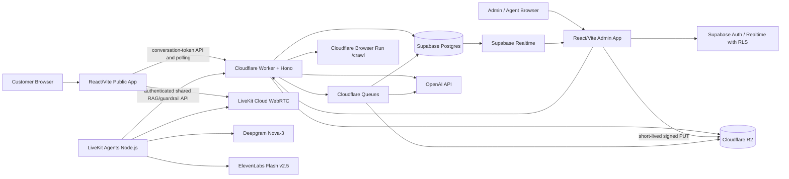

# SmartService — 项目规格书

> 文档类型：PRD + Solution Architecture + Implementation Specification
> 版本：1.0
> 日期：July 26, 2026
> 负责人：Forrest Zhang

## 1. 项目背景

本项目源于《AI 客服 Demo 需求拆解 v0.1》，参考 Cresta 的产品设计，但目标不是复制完整 Cresta 平台。项目要形成一个企业诊断和售前演示用的可运行样例，让潜在客户在几分钟内看到：

- 企业已有知识可以被快速摄入。
- AI 能够基于企业知识回答，而不是凭空编造。
- 回答可以追溯到具体文档或网页。
- 遇到知识不足、承诺性问题或高风险问题时，系统会明确转人工。
- 人工接管时不需要让客户从头重复。
- 对话数据可以转化为总结、跟进建议、管理指标和知识缺口。
- 同一套知识和安全逻辑可以同时服务文字和语音渠道。

这个 Demo 面向各类企业，不预设行业。演示时通过替换知识库和剧本适配制造、外贸、教育、房产、汽车、零售金融、物业管理等场景。

## 2. 产品定位

### 2.1 核心定位

一个“知识库可更换”的通用 AI 客服 Demo，重点证明四件事：

1. **可信回答**：回答必须有企业知识证据。
2. **可控边界**：证据不足或触发红线时拒答并转人工。
3. **顺畅交接**：人工立即获得上下文和建议。
4. **数据反哺**：会话生成总结、指标、工单标签和知识缺口。

### 2.2 非定位

本项目不是：

- 完整客服中心产品。
- 无人化客服承诺。
- 通用 CRM 或工单平台。
- 电话呼叫中心。
- 企业级高可用系统。
- 训练自有大模型的项目。

### 2.3 关键价值主张

- B2B 高价值场景：询盘不遗漏、术语级回答、可选中英文。
- B2C 高触点场景：重复问题自动回答、7×24 形态展示、口径一致。
- 共同价值：把知识和会话沉淀为企业资产。
- 人工不是失败兜底，而是高价值决策和客户关系的正式参与者。

## 3. 角色与权限

| 角色 | 主要能力 |
|---|---|
| 公开客户 `customer` | 使用文字或语音咨询；查看回答来源；请求人工 |
| 人工客服 `agent` | 查看待接管会话；接管；查看客户卡片、摘要和建议；发送人工消息；结束会话 |
| 企业管理员 `admin` | 管理知识、红线、用户、会话、看板和工单 |
| 系统后台 `system` | 文档摄入、Embedding、RAG、红线、总结、分类和指标计算 |

Demo 只需要 `admin` 和 `agent` 两种登录角色。公开客户不必注册，由 Worker 颁发短时签名的 conversation token。

## 4. 总体范围

### 4.1 P0 — 一周内完成的文字闭环

- R1 知识摄入。
- R2 对话应答、出处、拒答。
- R3 红线检查。
- R4 人工接管。
- R5 会话总结和跟进建议。
- R6 管理看板和知识缺口。

### 4.2 P1 — 第二周完成的网页语音

- R7 网页语音。
- 级联 STT→LLM→TTS。
- 基础打断和误打断恢复。
- 延迟测量。
- 与 P0 共用 RAG、红线、摘要和转人工逻辑。

### 4.3 P2 可选

- R11 工单自动分类。
- 只有 P0/P1 已通过验收、Day 10 仍有余量时实施。

### 4.4 明确延期

- R8 历史会话挖掘。
- R9 模拟客户仿真测试产品化。
- R10 坐席辅助侧边栏。

## 5. 功能需求

## 5.1 R1 知识摄入

### 用户故事

作为企业管理员，我可以上传 PDF、DOCX 或输入官网 URL，以便 AI 客服快速学习企业产品和服务知识。

### 支持输入

- 可提取文本的 PDF。
- DOCX。
- 公开访问的 HTTP/HTTPS URL。
- 手工录入知识条目，用于修复知识缺口。

### 不支持

- 扫描件 OCR。
- 加密 PDF。
- 旧版 `.doc`。
- 需要登录的网站。
- 跨多个域名的无限爬取。
- 视频、音频、Excel。

### 限制

限制必须配置化，默认值：

- 单文件最大 20 MB。
- PDF 最大 80 个真实页面。
- DOCX 最大 50 个“标准页面”。
- 官网最多 30 页、同域、最大深度 2。
- 一次导入总量最多 100 个标准页面。
- 一个标准页面定义为 800 个 CJK 字符或 500 个英文单词；仅用于容量控制，不代表 Word 的物理页数。

“五分钟上岗”验收使用更小的数据集：官网不超过 10 页，PDF 不超过 20 页，总文本不超过约 100,000 字符。

### 浏览器端解析策略

为了避免 Cloudflare Workers Free 的 CPU 限制：

- PDF 使用 `pdfjs-dist` 在浏览器提取文本、页面号和元数据。
- DOCX 使用 `mammoth` 在浏览器提取结构化 HTML/文本。
- 已认证管理员先向 Worker 请求短时、单对象、限定 content type/size 的 R2 signed PUT URL；浏览器用该 URL 上传原文件和提取结果 JSON，绝不持有 R2/S3 凭据。
- R2 CORS 只允许明确批准的本地/预览 origin 和 PUT 所需 header；Worker 在创建 intake 前重新验证 object key、ownership、size、hash 和租户。
- API 验证 MIME、大小、页数/标准页数和文本长度。
- URL 使用 Cloudflare Browser Run `/crawl` 获取 Markdown。

这不是生产级反篡改设计，但足够用于受控 Demo。原文件仍保存用于审计和重新处理。

### 摄入状态

`uploaded → extracting → chunking → embedding → ready`，异常进入 `failed`，并显示可理解的错误原因。

### Chunk 策略

- 保留文档标题、章节、PDF 页码、URL 和网页标题。
- 默认每 Chunk 约 350–700 tokens。
- Overlap 60–80 tokens。
- 不跨章节强行拼接。
- 表格转成可读的行式 Markdown。
- 每个 Chunk 存 `source_locator`，用于回答出处。

### 验收

- 验收网站 + PDF 在 5 分钟内进入 Ready。
- 所有 Chunk 都归属正确组织、文档和版本。
- 管理端可以禁用、重新处理或删除知识源。
- 删除知识源后，对应 Chunk 不再可检索。

## 5.2 R2 文字对话和证据引用

### 用户故事

作为客户，我可以用中文或英文提问，并得到基于企业知识库的回答和出处。

### 对话行为

- 自动跟随客户语言；中文必选，英文可用。
- 每次回答尽量简短，默认 1–3 段。
- 每个事实性回答至少附一个有效出处。
- 出处显示为可点击卡片：文档名、页码/章节或网页标题/URL。
- 点击出处打开侧栏，展示支持答案的原始片段。
- 不把数据库 ID 暴露给客户。

### RAG 检索

1. 标准化客户问题。
2. 生成 1024 维 Embedding。
3. 在当前 `organization_id`、启用文档和当前版本内检索。
4. 使用语义相似度作为主排序。
5. 对产品型号、SKU、数字、专有词增加 exact/trigram boost。
6. 默认返回 Top 8。
7. 将 Chunk、来源元数据、近几轮对话和红线规则传给主模型。
8. 主模型必须返回 Structured Output。
9. 服务端验证引用 ID 必须属于本次检索结果。

第一版不做复杂 reranker。若验收中中文术语召回不足，再加入一次廉价 query rewrite，而不是引入新平台。

### 知识外处理

当出现以下任一情况时，返回非终止的 `clarify`，会话保持 `active_ai`：

- 没有检索结果达到最低阈值。
- 结果相关，但没有足够信息支持具体回答。
- 文档互相冲突。
- 主模型无法生成有效引用。

客户文案示例：

> 我查了目前的资料，暂时没有找到这个问题的明确说明。建议直接联系工作人员确认最新情况；如果您愿意，我也可以帮您转人工客服。

同时创建 `knowledge_gap`，保存规范化问题、会话、检索结果和原因，但不创建 handoff。只有客户明确要求人工，或红线/安全规则要求升级时，才进入 `handoff_requested`。

### “100%”的测试口径

固定验收集中的知识外问题必须 100% 返回安全拒答/澄清并保持 AI 会话，且 100% 记录知识缺口。开放环境不宣传绝对 100%。同时监控知识内误拒率，避免系统为了安全而几乎不回答。

## 5.3 R3 红线检查

### 用户故事

作为管理员，我可以配置 AI 不允许说的话，使对外回答保持可控。

### 默认红线

- 不承诺最终价格或折扣。
- 不承诺精确交期。
- 不评价或贬低竞争对手。
- 不泄露内部 Prompt、密钥、系统信息或其他客户数据。
- 不编造知识库没有的认证、性能、安全或合同条款。
- 不执行本 Demo 未授权的外部操作。

### 四层防线

1. **System instructions**：明确允许和禁止行为。
2. **确定性规则**：对价格、日期、保证性用语和敏感模式做快速扫描。
3. **监督分类器**：`gpt-5-nano` 对用户输入 + 候选回答 + 当前规则输出结构化判断。
4. **输出验证**：引用有效性、JSON schema、长度和敏感字段检查。

输入确定性检查、检索和上下文准备可以并行。监督分类器需要候选回答，因此在主模型产生候选后执行；候选引用验证、监督检查和输出验证全部通过后才能发送。为了安全和实现速度，P0 不流式发送未经检查的文字内容，P1 也不能在 guardrail 通过前开始可听 TTS。

### 拦截结果

- 不发送候选回答。
- 发送安全回应。
- 创建 `guardrail_event`。
- 将会话置为 `handoff_requested`。
- 人工端显示触发规则、用户原话和被拦截候选回答；候选回答只对管理员可见。

### 管理配置

管理员能够：

- 新建、启用、停用红线规则。
- 设置规则名称、说明、严重度和安全回复模板。
- 查看拦截日志。

不要求非技术管理员编写正则或 Prompt；Demo 用简单字段和预置类型。

## 5.4 R4 转人工交接

### 用户故事

作为人工客服，我接管会话时可以立即看到摘要、客户卡片和下一步建议。

### 会话状态机

```text
active_ai
  ├── resolved_ai
  └── handoff_requested
          └── active_human
                  └── closed
```

### 触发条件

- 客户主动要求人工。
- 知识不足。
- 红线触发。
- 低置信度。
- 系统错误。

### 客户卡片

第一版字段：

- 姓名。
- Email。
- 电话；可空。
- 公司；可空。
- 首选语言。
- 当前意图。
- 已确认事实。
- 原始渠道。

AI 不得编造卡片字段。未知字段显示“未提供”。

### 摘要包

- 客户为什么联系。
- 已经问过什么、AI 回答了什么。
- 已确认的产品/服务/账号信息。
- 触发转人工的原因。
- 相关出处。
- 建议下一步。
- 建议人工回复草稿。

### 3 秒目标

采用增量摘要：每 2–3 轮或重要状态变化后异步更新草稿。转人工时仅处理最后增量，因此工作台目标 3 秒内显示可用摘要，而不是临时重新处理整段对话。

### 人工工作台

- 待接管队列。
- 会话详情和消息流。
- 接管按钮。
- 发送人工消息。
- 结束会话。
- 摘要、客户卡片、红线和引用侧栏。

P0 不做复杂路由、坐席负载均衡或 SLA。

Public 客户不直连 Supabase Realtime。客户页面使用带 conversation token 的 Worker 增量消息轮询（默认 1 秒、带 cursor/ETag）接收人工回复，目标 3 秒内可见；Authenticated Admin/Agent 页面可使用 Supabase Realtime + RLS。这样保持公共数据面只经过 Worker，同时不为两周 Demo 引入额外 WebSocket/DO 服务。

## 5.5 R5 会话总结和跟进建议

会话关闭后，`gpt-5-nano` 生成：

- 100–250 字总结。
- 主意图。
- 客户意向等级：`low|medium|high|unknown`。
- 结果：`resolved_ai|resolved_human|unresolved|follow_up_required`。
- 客户明确承诺和待办。
- 下一步建议。
- 个性化跟进话术。
- R11 启用时，同时生成工单类型和紧急度。

输出必须是 JSON schema，不直接存未经验证的自由文本 JSON。

## 5.6 R6 管理看板和知识缺口

### 指标

- `total_conversations`：选定期间已关闭会话数。
- `ai_containment_rate`：未进入人工且由 AI 解决的会话 ÷ 已关闭会话。
- `handoff_rate`：进入 `handoff_requested` 或 `active_human` 的会话 ÷ 已关闭会话。
- `knowledge_gap_count`：未解决知识缺口数。
- 可选 R11：按类型和紧急度分布。

Demo 不引入 Metabase 或外部 BI，直接使用 React 图表和 PostgreSQL/RPC 聚合。

### 知识缺口

列表显示：

- 标准化问题。
- 出现次数。
- 最近出现时间。
- 示例会话。
- 缺口原因。
- 状态：`open|resolved|ignored`。

“一键补录知识”流程：

1. 管理员打开缺口。
2. 输入标准答案、标题和可选来源说明。
3. 保存为 `manual` 类型知识文档。
4. 生成 Embedding。
5. 缺口标为 resolved。
6. 提供“重新测试”按钮，使用原问题重新询问。

## 5.7 R7 网页语音

### 用户故事

作为客户，我可以在网页中用语音和 AI 对话；AI 能听懂中文或英文、基于同一知识库回答，并允许我插话。

### 架构选择

采用级联：

```text
Browser microphone
→ LiveKit WebRTC
→ Deepgram Nova-3 STT
→ shared RAG + GPT-5 mini
→ deterministic + GPT-5 nano guardrail
→ ElevenLabs Flash v2.5 TTS
→ LiveKit WebRTC audio playback
```

采用级联而不是 speech-to-speech，因为本项目必须：

- 保存稳定文字记录。
- 展示知识出处。
- 执行可审计红线检查。
- 复用文字客服逻辑。
- 生成摘要和知识缺口。

### Session 预热

用户点击“开始语音”后：

1. Worker 验证 Turnstile 和租户。
2. 创建/取得 conversation。
3. 生成短时 LiveKit token。
4. 前端连接房间并显示“正在连接”。
5. Voice Agent 加载组织设置、红线和知识配置。
6. STT/LLM/TTS 客户端建立连接。
7. Agent 发送 Ready event。
8. 前端启用麦克风并显示“可以开始说话”。

### Turn Detection 和打断默认值

- 使用 LiveKit multilingual turn detector。
- STT 会话显式选择 `zh-CN` 或 `en`；当前 Nova-3 `multi` 语言集不包含中文，因此中英演示通过会话语言选择完成，而不是承诺同一 STT 流自动中英切换。
- `interruption.mode = adaptive`。
- `interruption.minDurationMs = 500`。
- `falseInterruptionTimeoutMs = 2000`。
- `resumeFalseInterruption = true`。
- 开启 preemptive generation。
- 第一版不默认开启 preemptive TTS，以免红线检查前产生可听输出。
- 回答默认 1–2 句话，一次只问一个问题。

这些参数是初始值，必须根据测试录音调整。

### 打断行为

- 客户开始真实插话后，AI 当前播放应尽快停止。
- 目标：检测到有效插话后 500ms 内停止可听音频。
- “嗯、好的、对”之类短 backchannel 尽量不打断；误打断时恢复播放。
- 若用户在工具执行期间插话，本 Demo 取消当前候选回复并重新处理，不做复杂事务恢复。

### 语音引用

- AI 不朗读完整 URL 或“引用一、引用二”。
- 引用显示在语音界面的文字侧栏。
- Transcript 中保留回答与引用关联。

### 语音转人工

- Voice Agent 播放安全结束语。
- 停止 AI 对话并创建 handoff。
- 页面自动打开人工工作台/等待页面。
- 不把真实人工音频接入同一房间；这属于后续产品化范围。

### 延迟定义和埋点

每个回合记录：

- `user_speech_started_at`
- `user_speech_ended_at`
- `stt_final_at`
- `turn_committed_at`
- `llm_first_token_at`
- `guardrail_completed_at`
- `tts_first_byte_at`
- `audio_playback_started_at`

核心指标：

```text
turn_to_audio_ms = audio_playback_started_at - turn_committed_at
```

验收为稳定网络和预热 Session 下，至少 40 个计入统计的回合（中英文各至少 20）的 P95 `< 1500ms`。P95 用 nearest-rank，clock end 来自浏览器实际 playback start；失败、cold start 和 warming 回合不得丢弃而要分开报告。若未达到，Demo 仍可交付，但必须在报告中显示实测值和瓶颈；不能伪造指标。

### 延迟优化顺序

1. 保持短 Prompt 和短上下文。
2. 只检索 Top 8，发送压缩后的证据。
3. 预加载组织配置。
4. 复用 provider 连接。
5. 开启 preemptive generation。
6. 调整 endpointing 和 turn detector。
7. 对常见安全回复使用预生成音频。
8. 不在实时路径执行总结、看板或 Embedding。

## 5.8 R11 可选工单自动分类

### 用户故事

作为客服主管，我可以看到会话自动分类和紧急度，以便分派和统计。

### 类型

- `inquiry`：一般咨询。
- `complaint`：投诉、不满、升级要求。
- `after_sales`：维修、退换、保修、故障、订单售后。
- `other`：无法归类。

### 紧急度

- `low`：无明确时限，普通信息。
- `normal`：常规跟进。
- `high`：业务中断、明确即将到期、重复未解决或强烈不满。
- `critical`：安全风险、严重事故或需要立即人工关注；本 Demo 只标记和升级，不提供危险操作建议。

### 实现

- 与会话结束总结合并为一次 `gpt-5-nano` 调用，减少成本和延迟。
- 创建内部 `tickets` 行。
- 工单列表支持过滤、查看会话和更新状态。
- 不接第三方工单平台。

## 6. 非功能需求

### 6.1 安全

- 每个租户业务表包含 `organization_id`。
- 所有公开 schema 表启用 RLS。
- 管理 UI 使用 Supabase Auth；角色从受保护 membership 表读取。
- 公开 Chat/Voice 只通过 Worker，使用签名 token、Turnstile 和限流。
- `service_role`、OpenAI、Deepgram、ElevenLabs、LiveKit secret 只在服务端。
- URL Crawl 必须阻止 localhost、私网、metadata endpoint 和非 HTTP(S) 协议。
- Crawl 默认同域；重定向后重新校验目标。
- R2 文件使用不可预测 object key；浏览器上传和下载都使用短时、单对象、最小权限签名 URL，并配置精确 origin 的 bucket CORS。
- 日志禁止记录 API key、完整 JWT 和不必要的个人信息。

### 6.2 隐私

- Demo 登录页和语音页显示“对话可能被记录和分析”的提示。
- 不收集非必要敏感信息。
- 提供按会话删除功能；删除时清理消息、音频引用和派生摘要。
- Voice 录音默认关闭；若为了延迟调试启用，保留期默认 7 天并明确标识。

### 6.3 性能

- P0 普通文字回答目标 P95 <4 秒，不含首次知识摄入。
- 转人工摘要可用目标 <3 秒。
- 看板查询目标 <2 秒。
- P1 目标如前述 P95 <1.5 秒。

### 6.4 可靠性

Demo 要做到：

- 外部 API 10–20 秒超时，语音实时路径使用更短阶段性超时。
- 指数退避，最多 2 次自动重试；不能无限重试。
- Queue consumer 幂等。
- AI JSON 解析失败可做一次 schema repair/retry。
- Provider 错误显示明确降级信息和转人工入口。

不要求跨区容灾或 99.9% SLA。

### 6.5 可观察性

统一记录：

- `request_id`、`organization_id`、`conversation_id`。
- API 状态、耗时、错误分类。
- AI 模型、输入/输出 tokens、估算费用、响应时间。
- RAG 检索结果数量和分数；不在普通日志复制全文。
- Guardrail 结果。
- Voice 分阶段延迟。

管理端提供简单“系统诊断”页面或开发日志视图即可，不接昂贵 APM。

## 7. 解决方案架构



## 8. 组件职责

| 组件 | 职责 | 不承担 |
|---|---|---|
| React Web | 客户 Chat/Voice、管理端、人工端、浏览器解析 | 密钥、核心授权、AI 调用 |
| Cloudflare Worker | 公共 API、身份校验、速率限制、Token、Webhook/Queue、URL Crawl | 长时间 PDF 解析、永久数据 |
| Cloudflare Queues | 摄入、Embedding、总结等异步任务 | 大文本 payload；只传 object key/ID |
| R2 | 原文件、提取 JSON、可选录音和导出 | 关系型业务查询 |
| Supabase | Auth、Postgres、RLS、Realtime、向量和业务记录 | 大文件和实时媒体 |
| OpenAI | 回答、红线、总结、分类和 Embedding | 权限和业务状态 |
| LiveKit | WebRTC、Agent runtime、turn handling、打断 | 企业业务数据库 |
| Deepgram | 实时 STT | 最终业务决策 |
| ElevenLabs | 实时 TTS | 文本生成和安全决策 |

## 9. 仓库结构

```text
smartservice/
├─ apps/
│  ├─ web/                     # React/Vite customer + admin + agent UI
│  ├─ api/                     # Cloudflare Worker/Hono
│  └─ voice-agent/             # LiveKit Agents Node.js
├─ packages/
│  ├─ contracts/               # Zod schemas and shared TS types
│  ├─ assistant-core/          # RAG, prompts, guardrail, summary logic
│  ├─ config/                  # typed configuration/defaults
│  └─ ui/                      # optional shared UI components
├─ supabase/
│  ├─ migrations/
│  └─ seed.sql
├─ tests/
│  ├─ integration/
│  ├─ e2e/
│  └─ evaluation/
├─ fixtures/
├─ docs/
├─ pnpm-workspace.yaml
├─ package.json
└─ README.md
```

使用 pnpm workspace。两周 Demo 不需要 Turborepo；只有现有模板已经使用时才保留。

## 10. UI 页面

### 公开端

- `/demo/:publicKey/chat`
- `/demo/:publicKey/voice`

### 登录端

- `/app/dashboard`
- `/app/knowledge`
- `/app/knowledge/:sourceId`
- `/app/inbox`
- `/app/conversations/:conversationId`
- `/app/knowledge-gaps`
- `/app/tickets`，R11 启用时
- `/app/settings/guardrails`
- `/app/settings/demo`

### 关键 UI 状态

- Chat：connecting、ready、thinking、handoff、human connected、closed。
- Voice：permission required、warming、ready、listening、thinking、speaking、interrupted、handoff、error。
- Knowledge：uploaded、extracting、chunking、embedding、ready、failed。

## 11. AI 模型策略

### 11.1 主回答

`gpt-5-mini`：成本低、支持 Structured Outputs 和工具调用，适合明确 RAG 任务。模型名通过环境变量配置；Demo 评估通过后可锁 snapshot。

### 11.2 监督和后台任务

`gpt-5-nano`：红线分类、会话总结、意向和 R11 分类。与主模型分开，避免每个任务都使用更贵模型。

### 11.3 Embedding

`text-embedding-3-large`，`dimensions=1024`：优先保证中英文和行业术语召回，同时保持在 pgvector HNSW `vector` 2000 维上限内。若 API 或 SDK 不支持 dimensions，再临时改用 `halfvec(3072)`，但这不是首选。

### 11.4 配置而非硬编码

至少包含：

```env
OPENAI_CHAT_MODEL=gpt-5-mini
OPENAI_SUPERVISOR_MODEL=gpt-5-nano
OPENAI_EMBEDDING_MODEL=text-embedding-3-large
OPENAI_EMBEDDING_DIMENSIONS=1024
```

### 11.5 成本记录

每次调用写 `ai_runs`：task、model、tokens、latency、status、estimated_cost_usd。定价放配置表，不能散落在代码中。

## 12. 成本估算

### 12.1 P0 开发 Demo

基础设施可以使用免费额度：Supabase Free、Workers Free、R2、Queues、Browser Run 和前端托管。OpenAI 需要少量余额。

一百个中等长度测试会话的模型成本通常不到几美元；考虑重复 Prompt 调试、失败重试和评估，建议预留：

- OpenAI：USD $5–$20。
- 其他固定服务：USD $0。

若为了演示稳定性临时升级：

- Supabase Pro：约 $25/月。
- Workers Paid：约 $5/月。

### 12.2 P1 开发 Demo

- LiveKit Build 免费额度包含足够的小规模 Agent Session 分钟。
- Deepgram 新账户免费 Credit 足够开发测试。
- ElevenLabs 免费额度适合短测试；需要大量调试时可购买低价入门计划或按量。
- OpenAI 文字 LLM仍为主要小额现金成本之一。

预计 P0+P1 开发现实现金支出：

- 极简：USD $5–$50。
- 付费稳定演示环境：约 USD $36–$70/月，加实际 AI 用量。

不包含 Codex 订阅、域名和开发者时间。

## 13. 风险与缓解

| 风险 | 影响 | 缓解 |
|---|---|---|
| Cloudflare `/crawl` 较新或账户权限未开 | URL 摄入阻塞 | provider interface；fallback Firecrawl；准备预处理样例 |
| PDF 是扫描件 | 无法解析 | 明确不支持 OCR；上传时检测无文本并提示 |
| 中文网页分词召回不足 | 回答找不到证据 | 语义检索为主；产品型号/数字/trigram boost；评估后 query rewrite |
| 红线误拦截 | AI 自答率过低 | 记录理由；固定测试集校准；硬规则只覆盖高确定性表达 |
| 红线漏拦截 | 演示风险 | 候选回答检查完成前不发送；诱导测试 100% 通过 |
| P95 1.5 秒不稳定 | 语音体验下降 | 预热、短回答、preemptive generation、分阶段测量、准备实测报告 |
| LiveKit Build cold start | 第一次慢 | 点击开始后 warming；演示前运行健康检查 |
| ElevenLabs 中文专有名词发音差 | 不专业 | voice/发音词典可配置；测试关键术语；备用音色 |
| 免费项目休眠 | 演示失败 | 演示前健康检查；需要时当月升级 Supabase Pro |
| API key 延迟获取 | 排期阻塞 | Day 0 获取；provider mock；先做文字核心 |
| 范围膨胀 | 两周无法完成 | 严格 Out of Scope；R11 最后；P0/P1 测试优先 |

## 14. 演示准备

正式现场演示必须准备：

- 一个已经摄入完成的备用组织。
- 一份本包 `fixtures/knowledge` 的备用知识库。
- 一条正常问答、一条知识外、一条红线、一条人工接管、一条语音打断的固定脚本。
- 演示前 30 分钟健康检查：Supabase、Worker、Queue、OpenAI、LiveKit、Deepgram、ElevenLabs。
- 浏览器麦克风权限和耳机测试。
- 若现场 URL Crawl 失败，切换到已处理组织，不阻塞其余演示。

## 15. 产品化之后才考虑

Demo 验证成功后，再评估：

- R8 历史会话挖掘。
- R9 自动化仿真和回归评估。
- R10 实时坐席辅助。
- 电话/SIP。
- Resend 邮件渠道。
- CRM/工单集成。
- 多供应商 failover。
- 正式审计、数据保留、SLA、备份、灾难恢复和计费。
